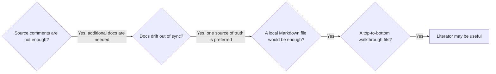

Generate readable Markdown walkthroughs from TypeScript source files.

Think of it as augmented source code for richer documentation: headings, prose, lists, diagrams, images, and small asides, all generated from the source file itself.

It is useful when normal comments are not quite enough, but a separate documentation system would be too much.

It also helps with a common problem: documentation and source code drift apart easily. Literator keeps the source file as the single source of truth, and the Markdown walkthrough can be regenerated whenever the code changes.

Literator is intentionally simple: one small script, no config, no AST parsing. Sometimes that is better than separate docs, and often it is all you need.

## When should you use it?

