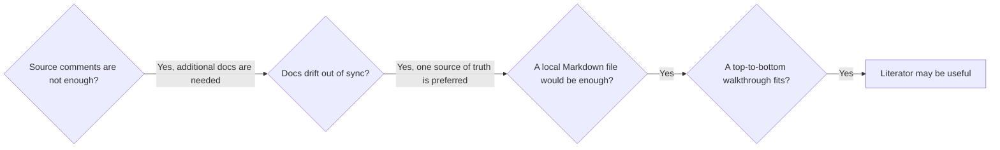

# Literator

Generate readable Markdown walkthroughs from TypeScript source files.

Think of it as augmented source code for richer documentation: headings, prose, lists, diagrams, images, and small asides, all generated from the source file itself.

It is useful when normal comments are not quite enough, but a separate documentation system would be too much.

It also helps with a common problem: documentation and source code drift apart easily. Literator keeps the source file as the single source of truth, and the Markdown walkthrough can be regenerated whenever the code changes.

Literator is intentionally simple: one small script, no config, no AST parsing. Sometimes that is better than separate docs, and often it is all you need.



## Quickstart

### ✏️ Choose the source files to literate
Annotate them with:

```ts
// @literator-literate
```

### 📝 Write comments with Markdown syntax:

```ts
/*
# This is my header

Starting a <strong>paragraph</strong> here,
for documentation...
*/
```

### ▶️ Run Literator:

```bash
npx literator
```

### 🏁 Done
Markdown is generated beside each marked source file:

```text
src/index.ts -> src/index.ts.literated.md
```

<br>

## Example

### Source code:

````ts
// @literator-literate

/*
# Pancake order

This tiny file walks through a mighty little pancake orchestrator:

1. Get the recipe.
2. Make pancakes.
3. Say it is done.


*/

/*
## 1. Get the recipe

@literator-collapse-start Why this is a stub
A real app might summon the instructions from a cooking wizard.
For this demo, we keep the steps local.
@literator-collapse-end
*/

function getRecipe(): string {
  return "pancake recipe";
}

/*
## 2. Make pancakes

Now the batter meets the pan. No drama, just pancakes.
*/

function makePancakes(recipe: string): string {
  return `Made pancakes from ${recipe}`;
}

/*
## 3. Say it is done

The pancakes have landed.
*/

const recipe = getRecipe();
const pancakes = makePancakes(recipe);

console.log(`${pancakes}. Done!`);
````

### Generated Markdown output:

````md
<!-- Generated by Literator from examples/src/index.ts at 2026-05-20T22:04:24.047Z. Edit the source file instead. -->

# Pancake order

This tiny file walks through a mighty little pancake orchestrator:

1. Get the recipe.
2. Make pancakes.
3. Say it is done.


## 1. Get the recipe

<details>
<summary>Why this is a stub</summary>

A real app might summon the instructions from a cooking wizard.
For this demo, we keep the steps local.

</details>

```ts
function getRecipe(): string {
  return "pancake recipe";
}
```

## 2. Make pancakes

Now the batter meets the pan. No drama, just pancakes.

```ts
function makePancakes(recipe: string): string {
  return `Made pancakes from ${recipe}`;
}
```

## 3. Say it is done

The pancakes have landed.

```ts
const recipe = getRecipe();
const pancakes = makePancakes(recipe);

console.log(`${pancakes}. Done!`);
```
````

See it rendered: [examples/src/index.ts.literated.md](examples/src/index.ts.literated.md).

<br>

## Options

### ⚙️ Install it locally

If that's what you prefer:

```bash
npm install -D literator
```

### ▶️ Literating

By default, Literator scans the `src` folder. To scan a different folder:

```bash
npx literator app
```

Only `.ts` and `.tsx` files are supported for now.


### 📝 Markdown in the Comments

Line comments become Markdown:

```ts
// ## A Markdown heading
//
// Markdown prose here.
```

Standalone block comments also become Markdown:

```ts
/*
## Another heading

More Markdown prose here.
*/
```

There is no sorcery here, normal Markdown features just work naturally, including Mermaid diagrams and images:

```ts
// ```mermaid
// flowchart LR
//   A --> B
// ```
//
// 
```

None of the Literator annotations appear in the Markdown.

Generated Markdown starts with a hidden notice:

```md
<!-- Generated by Literator from <source-file> at <timestamp>. Edit the source file instead. -->
```


### ↕️ Collapsible Sections

When there is too much going on in the Markdown, these sections are collapsible and expandable to keep the view tidy.

```ts
// @literator-collapse-start Internal notes
// This content is collapsed by default.
// @literator-collapse-end
```

If the title is omitted, Literator uses: `Expand this section`.

<br>

## License

[MIT](LICENSE)
