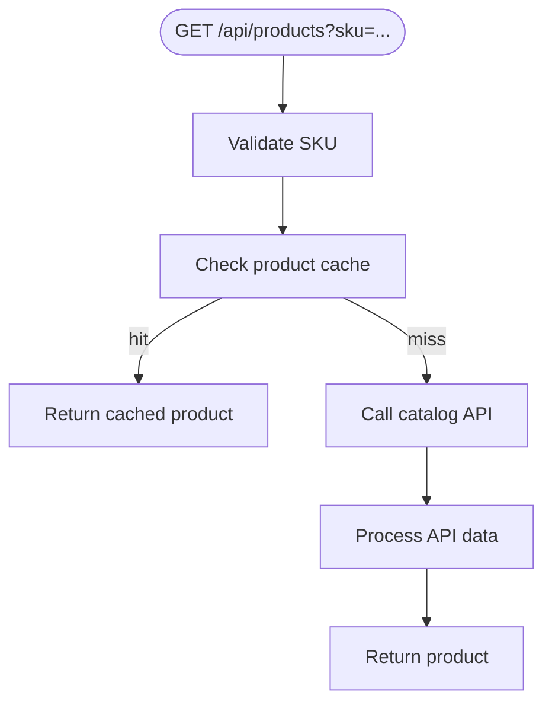

# Literator

Generate readable Markdown walkthroughs from TypeScript source files.

Literator turns source comments into richer Markdown documentation: headings, prose, lists, diagrams, images, and small asides.

The generated walkthrough keeps the full code alongside the prose, so it remains a complete, readable reference for the implementation.

The source file stays the single source of truth. When the code changes, regenerate the Markdown walkthrough.

Minimal by design: one small script, deterministic output, no AST parsing, no config.


## Quickstart

### ✏️ Choose the source files to literate
Annotate them with:

```ts
// @literator-literate
```

### 📝 Write comments with Markdown syntax:

```ts
/*
# This is my header

Starting a <strong>paragraph</strong> here,
for documentation...
*/
```

### ▶️ Run Literator:

```bash
npx literator
```

### 🏁 Done
Markdown is generated beside each marked source file:

```text
src/index.ts -> src/index.ts.literated.md
```

See the [product route example](https://github.com/crocodile/literator/blob/master/examples/src/index.ts.literated.md), or the [pancake example](https://github.com/crocodile/literator/blob/master/examples/src/pancake.ts.literated.md).

<br>

## Example

### Source code:

````ts
/* @literator-literate

# Product route sketch

This Literator skeleton example walks through a product lookup, from storefront request to catalog response.


*/

// @literator-collapse-start Supporting Setup
type RouteRequest = { query?: { sku?: string } };
const cache = new Map<string, unknown>();
// @literator-collapse-end

/*
## GET /api/products
A product page arrives with a SKU. The route follows the same order every time: identify the product, reuse known data when possible, and ask the catalog when the cache is empty.
| Situation | Route response |
| --- | --- |
| Product is cached | Return the cached product |
| Product is not cached | Ask the catalog service |
*/
export async function GET(request: RouteRequest) {
  const sku = getSku(request);
  const body = cache.get(sku) ?? processApiData(await fetchProduct(sku));
  return { status: 200, body };
}

/*
### Read the SKU
The SKU is the product's shelf label. Once the request has a usable SKU, the rest of the lookup has something small and reliable to carry forward.
*/
function getSku(request: RouteRequest) { return request.query?.sku?.trim() ?? "demo-sku"; }

/*
### Fetch Product Details
When the cache has no answer, the catalog service becomes the source of truth. It knows the product name, price, and current details.
*/
async function fetchProduct(sku: string): Promise<unknown> { return /* catalog request */ { sku }; }

/*
### Prepare Storefront Data
Catalog data is usually shaped for internal systems. Before it reaches the storefront, it gets trimmed into the small product card the page actually needs.
*/
function processApiData(data: unknown) { return data; }
````

### Generated Markdown output:

````md
<!-- Generated by Literator from examples/src/index.ts at 2026-05-22T00:34:35.191Z. Edit the source file instead. -->

# Product route sketch

This Literator skeleton example walks through a product lookup, from storefront request to catalog response.



<details>
<summary>Supporting Setup</summary>

```ts
type RouteRequest = { query?: { sku?: string } };
const cache = new Map<string, unknown>();
```

</details>

## GET /api/products
A product page arrives with a SKU. The route follows the same order every time: identify the product, reuse known data when possible, and ask the catalog when the cache is empty.
| Situation | Route response |
| --- | --- |
| Product is cached | Return the cached product |
| Product is not cached | Ask the catalog service |

```ts
export async function GET(request: RouteRequest) {
  const sku = getSku(request);
  const body = cache.get(sku) ?? processApiData(await fetchProduct(sku));
  return { status: 200, body };
}
```

### Read the SKU
The SKU is the product's shelf label. Once the request has a usable SKU, the rest of the lookup has something small and reliable to carry forward.

```ts
function getSku(request: RouteRequest) { return request.query?.sku?.trim() ?? "demo-sku"; }
```

### Fetch Product Details
When the cache has no answer, the catalog service becomes the source of truth. It knows the product name, price, and current details.

```ts
async function fetchProduct(sku: string): Promise<unknown> { return /* catalog request */ { sku }; }
```

### Prepare Storefront Data
Catalog data is usually shaped for internal systems. Before it reaches the storefront, it gets trimmed into the small product card the page actually needs.

```ts
function processApiData(data: unknown) { return data; }
```
````

See it rendered: [examples/src/index.ts.literated.md](https://github.com/crocodile/literator/blob/master/examples/src/index.ts.literated.md).

<br>

## Options

### ⚙️ Install it locally

If that's what you prefer:

```bash
npm install -D literator
```

### ▶️ Literating

By default, Literator scans the `src` folder. To scan a different folder:

```bash
npx literator app
```

Only `.ts` and `.tsx` files are supported for now.


### 📝 Markdown in the Comments

Line comments are read as Markdown:

```ts
// ## A Markdown heading
//
// Markdown prose here.
```

Standalone block comments are read as Markdown too:

```ts
/*
## Another heading

More Markdown prose here.
*/
```

There is no sorcery here, normal Markdown features just work naturally, including Mermaid diagrams and images:

```ts
// ```mermaid
// flowchart LR
//   A --> B
// ```
//
// 
```

None of the Literator annotations appear in the Markdown.

Generated Markdown starts with a hidden notice:

```md
<!-- Generated by Literator from <source-file> at <timestamp>. Edit the source file instead. -->
```


### ↕️ Collapsible Sections

When there is too much going on in the Markdown, these sections are collapsible and expandable to keep the view tidy.

```ts
// @literator-collapse-start Internal notes
// This content is collapsed by default.
// @literator-collapse-end
```

If the title is omitted, Literator uses: `Expand this section`.

<br>

## License

[MIT](LICENSE)
