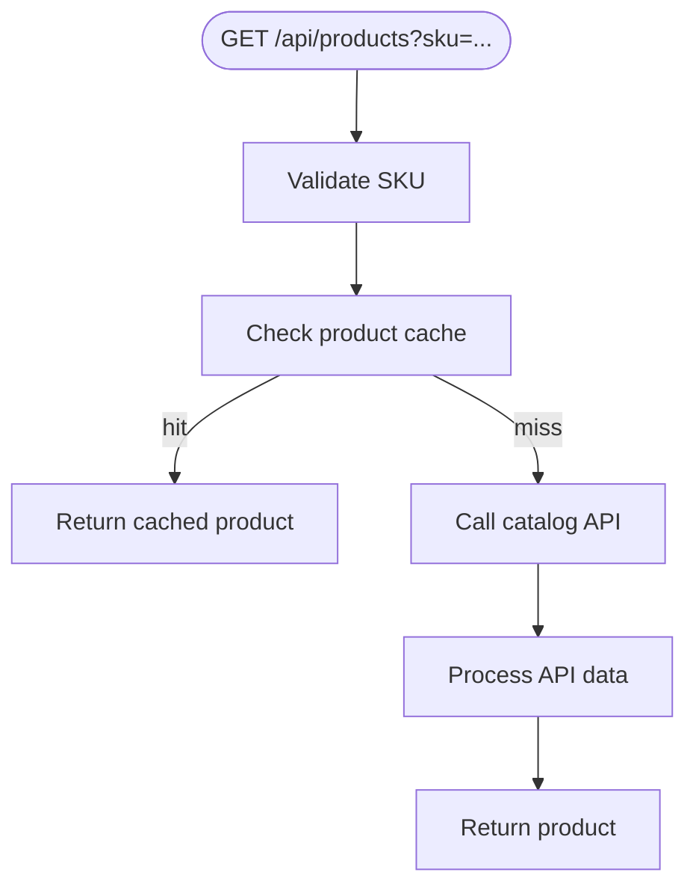

<!-- Generated by Literator from examples/src/index.ts at 2026-05-22T00:55:30.090Z. Edit the source file instead. -->

# Product route sketch

This Literator skeleton example walks through a product lookup, from storefront request to catalog response.



<details>
<summary>Supporting Setup</summary>

```ts
type RouteRequest = { query?: { sku?: string } };
const cache = new Map<string, unknown>();
```

</details>

## GET /api/products
A product page arrives with a SKU. The route follows the same order every time: identify the product, reuse known data when possible, and ask the catalog when the cache is empty.
| Situation | Route response |
| --- | --- |
| Product is cached | Return the cached product |
| Product is not cached | Ask the catalog service |

```ts
export async function GET(request: RouteRequest) {
  const sku = getSku(request);
  const body = cache.get(sku) ?? processApiData(await fetchProduct(sku));
  return { status: 200, body };
}
```

### Read the SKU
The SKU is the product's shelf label. Once the request has a usable SKU, the rest of the lookup has something small and reliable to carry forward.

```ts
function getSku(request: RouteRequest) { return request.query?.sku?.trim() ?? "demo-sku"; }
```

### Fetch Product Details
When the cache has no answer, the catalog service becomes the source of truth. It knows the product name, price, and current details.

```ts
async function fetchProduct(sku: string): Promise<unknown> { return /* catalog request */ { sku }; }
```

### Prepare Storefront Data
Catalog data is usually shaped for internal systems. Before it reaches the storefront, it gets trimmed into the small product card the page actually needs.

```ts
function processApiData(data: unknown) { return data; }
```
